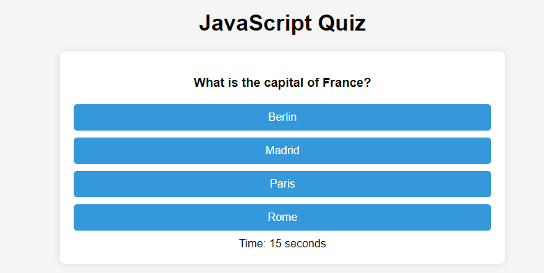

# JavaScript Quiz

JavaScript Quiz is a simple interactive quiz application built using HTML, CSS, and JavaScript.
Users can answer a series of multiple-choice questions within a time limit and then submit their scores.
High scores are saved to local storage for future reference.

## Features

1. Multiple-choice quiz questions.
2. Timer to limit the time for answering questions.
3. Score tracking.
4. Saving high scores to local storage.
5. Responsive design for various screen sizes.
 
## Usage

Click the "Start Quiz" button to begin the quiz.

Answer the multiple-choice questions within the given time limit.

For each correct answer, your score will increase. For incorrect answers, a time penalty is applied.

After completing the quiz or when the timer runs out, you'll be taken to the game over screen.

Enter your initials and click "Submit" to save your score to the local storage.

You can view the saved scores by reloading the quiz or revisiting the application later.

## Customization
You can customize the quiz questions, answers,
and the time limit by modifying the questions and timePerQuestion variables in the quiz.js file.
You can also customize the styling by editing the style.css file.

## License
N/A